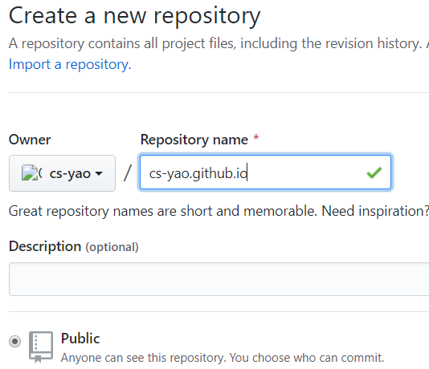

Markdown文件是很方便的笔记工具，但云笔记对其的支持都远不如Typora。而Hexo是使用markdown编辑博客.使用Hexo搭建个人博客，将编写的Markdow笔记以博客的形式发布到Github等上面。除了可以更方便的总结个人知识，还可以分享知识和展示自我。一举多得。

[Hexo官网](https://hexo.io/zh-cn/docs/)

#### 安装

环境依赖nodejs和git。以下命令皆在Windows的PowerShell中运行。

~~~shell
# 安装hexo，建议使用npm的阿里镜像来安装。
# cnpm相当于npm --registry=https://registry.npm.taobao.org
# $ npm install -g cnpm --registry=https://registry.npm.taobao.org 
# $ cnpm install hexo-cli -g
npm install hexo-cli -g
~~~

#### 初始化博客程序

~~~shell
# 在需要存放的目录执行以下命令，blog为自定义的目录
hexo init blog
cd blog
npm install
hexo server
~~~

运行成功，访问localhost:4000可以看到默认效果。

博客的配置文件在博客根目录下的_config.yml文件中，大部分都在此文件中配置。以下配置标题作者等：

~~~yml
# Site
title: 程式垚
subtitle: ''
description: ''
keywords:
author: cs-yao
language: zh-cn
timezone: ''
~~~

效果如下:

#### 新建博客

尝试效果，先新建一个简单的博客看看。使用vscode打开博客目录（或者先博客目录新开一个powershell），在控制终端输入以下命令

~~~shell
hexo new 新的博客
# INFO  Created: D:\github\blog\source\_posts\新的博客.md
~~~

hexo将在source/_posts目录下新建一个新的md文件，作为你的文章文件。可以说所有博客文章都在source/_posts内。新文件内容如下：

其中信息见名如意。刷新localhost:4000可以看到新文章的出现。

#### 文章图片

如果使用本地图片作为博客图片的话，需要使用图片插件（或者使用hexo3以上的图片语法，typora不支持，pass）

1. 安装插件

   ~~~shell
   cnpm install hexo-asset-image --save
   ~~~

2. 修改配置

   ~~~yml
   # 修改博客根目录下_config.yml配置文件post_asset_folder项为true
   post_asset_folder: true
   ~~~

3. 使用图片相对目录

   ~~~shell
   # 新建一篇博客时，会同时新建同名的文件夹，博客中的图片需要使用该目录下的图片引用
   hexo new "新的博客"
   ~~~

   

   文章中添加图片

   

   4. 重启hexo服务（改了_config.yml配置就可能需要重启），刷新页面，查看效果

      ~~~shell
      # ctrl+c结束服务
      INFO  Good bye
      PS D:\github\blog> hexo server
      ~~~

      

基本操作如此，接下来就是发布到github了。

#### 发布

##### 新建仓库

在github上新建一个名为<user-name>.github.io的公共仓库，<user-name>就是你的用户名。

##### 配置发布地址

在博客根目录下的_config.yml文件中配置发布信息，如下

~~~yml
deploy:
  type: git
  repo: https://github.com/cs-yao/cs-yao.github.io # 你的仓库地址
  branch: master  #分支
~~~

##### 安装git插件

发布到git需要git插件支持

~~~shell
cnpm install hexo-deployer-git --save
~~~

##### 发布博客

~~~sell
hexo clean
hexo deploy
~~~

编译后和输入github用户名密码，等待完成。

就可以在<user-name>.github.io上看到发布的博客了。

以上，完成了博客的基本搭建，接下来会使用最受欢迎的next主题优化。