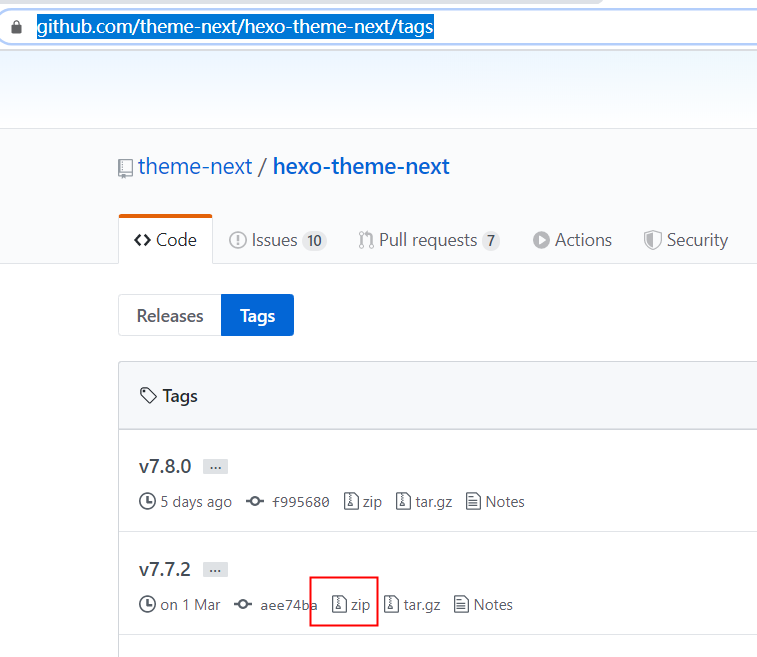
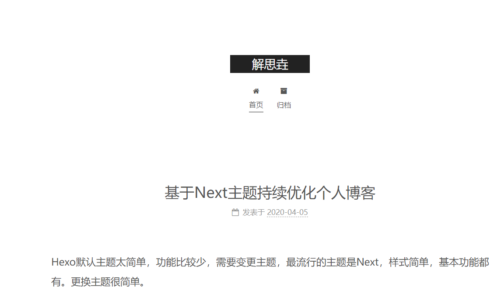
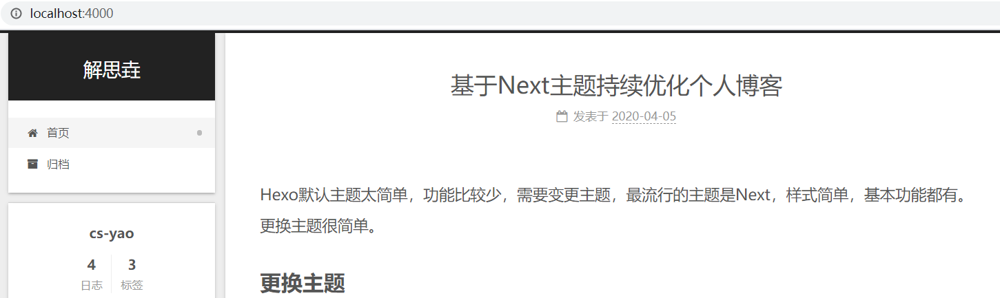

Hexo默认主题太简单，功能比较少，需要变更主题，最流行的主题是Next，样式简单，基本功能都有。更换主题很简单。

## 更换主题

Hexo官网中有很多推荐主题（[Hexo主题](https://hexo.io/themes/)），在其中搜索Next，可以查看示例（版本发布说明）与进入github代码库。

进入Github下载上一个稳定版本，[https://github.com/theme-next/hexo-theme-next/tags](https://github.com/theme-next/hexo-theme-next/tags)，我下载的是7.7.2版本。

下载后，解压到博客目录下的themes目录内，blog/themes/next-7.7.2。然后变更主配置文件的theme

~~~yml blog/_config.yml
theme: next-7.7.2
~~~

重启Hexo服务，查看效果（我已经在主配置中修改了博客名：解思垚）：

<!-- more -->

## 配置Next

配置参考：[Next-Getting-Started](https://theme-next.org/docs/getting-started/)

### 修改样式

~~~yml next-7.7.2/_config.yml
#scheme: Muse
#scheme: Mist
#scheme: Pisces
scheme: Gemini #左小右大
~~~

### 添加标签

~~~shell
hexo new page tags # INFO  Created: D:\github\blog\source\tags\index.md
~~~

在新建的blog/source/tags/index.md中修改标签页

~~~markdown source/tags/index.md
---
title: 标签
date: 2020-04-05 23:03:46
type: tags
---
~~~

将标签页加到菜单中

~~~yml next-7.7.2/_config.yml
menu:
  home: / || home
  #about: /about/ || user
  tags: /tags/ || tags
~~~

|| 前是目录，|| 后是图标

tag添加在文章的头部说明中。

### 添加分类

分类和标签类似，略

### 添加图册

类似分类和标签。

1. 添加画册页

   ~~~shell
   hexo new page photos # INFO  Created: D:\github\blog\source\photos\index.md
   ~~~

2. 修改画册页信息

   图片路径使用线段目录，事先复制了图片都该目录

   ~~~markdown blog/source/photos/index.md
   ---
   title: 相册
   date: 2020-04-06 01:22:10
   layout: post
   photos:
   - ../images/my-avatar.jpg
   - ../images/my-avatar.jpg
   - ../images/my-avatar.jpg
   - ../images/my-avatar.jpg
   ---
   
   ~~~

3. 将画册页添加到菜单中

   菜单名添加到在i18n中，比如zh-CN：

   ~~~yml next-7.7.2/languages/zh-CN.yml
   menu:
     home: 首页
     archives: 归档
     categories: 分类
     tags: 标签
     about: 关于
     search: 搜索
     schedule: 日程表
     sitemap: 站点地图
     commonweal: 公益 404
     photos: 相册
   ~~~

   添加到菜单：

   ~~~yml next-7.7.2/_config.yml
   menu:
     home: / || home
     #about: /about/ || user
     tags: /tags/ || tags
     categories: /categories/ || th
     archives: /archives/ || archive
     photos: /photos/ || photo
   ~~~

   相册更好的展现，最方便的是使用插件，比如：JustifiedGallery

## 侧边栏配置

参考 [侧边栏配置](https://theme-next.org/docs/theme-settings/sidebar)

### 头像

指定图片路径，头像复制到next-7.7.2/source/images下

~~~yml next-7.7.2/_config.yml
avatar:
  # Replace the default image and set the url here.
  url: /images/my-avatar.jpg
  # If true, the avatar will be dispalyed in circle.
  rounded: true
~~~

### 滚动条

~~~yml
back2top:
  enable: true
  # Back to top in sidebar. 是否在侧边栏显示
  sidebar: true
  # Scroll percent label in b2t button. 百分比
  scrollpercent: true
~~~

## 搜索

参考 [搜索服务](https://theme-next.org/docs/third-party-services/search-services)

1. 添加插件

   ~~~shell
   cnpm install hexo-generator-searchdb --save
   ~~~

2. 添加主配置支持，在主配置文件中添加如下内容：

   ~~~yml blog/_config.yml
   search:
     path: search.xml
     field: post
     format: html
     limit: 10000
   ~~~

3. 添加Next支持，在next配置文件中开启本地搜索：

   ~~~yml next-7.7.2/_config.yml
   # Local Search
   # Dependencies: https://github.com/theme-next/hexo-generator-searchdb
   local_search:
     enable: ture
   ~~~

## 其他功能

### 画廊

文章内图片支持浮现，但会显示图片标题

~~~yml next-7.7.2/_config.yml
fancybox: true
~~~

目前的功能够用了，如果修改后续更新。修改的话可能就要换个主题了，比如:icarus

### 摘要

在文中插入

~~~markdown
<!-- more -->
~~~

### ico

~~~yml next-7.7.2/_config.yml
favicon:
  small: /images/favicon-16x16-next.png
  medium: /images/favicon-32x32-next.png
~~~

其他参考，[https://www.cnblogs.com/zhangxiaochn/p/Hexo_Theme_Next.html](https://www.cnblogs.com/zhangxiaochn/p/Hexo_Theme_Next.html)